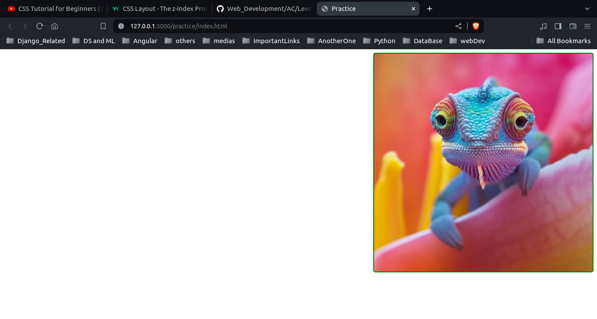
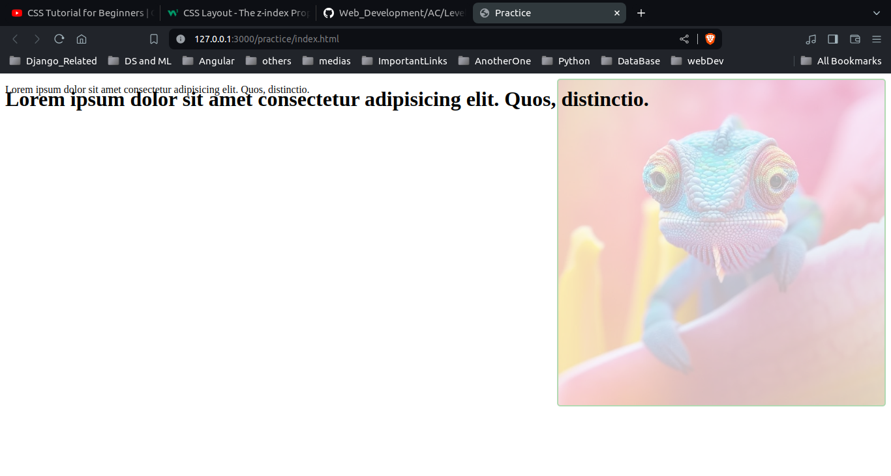

# Practice






```
div{
    border: 2px solid green;
    width: 500px;
    height: 500px;
    border-radius: 5px;
    background-image: url("https://letsenhance.io/static/8f5e523ee6b2479e26ecc91b9c25261e/1015f/MainAfter.jpg");
    background-size: cover;
    background-position: center;

    /*background-size: contain;
    background-repeat: no-repeat; */

    float: right; 
    opacity: 0.3;  
}
```