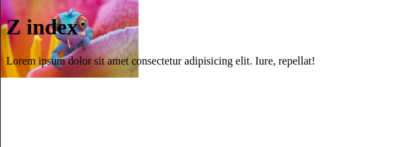

# Z Index

```
<h1>Z index</h1>


<p>Lorem ipsum dolor sit amet consectetur adipisicing elit. Iure, repellat!</p>
```

### CSS

```
 <style>
    img{
        position: absolute;
        left: 0;
        top: 0;
        z-index: -1;
    }
</style>
```



> If we put `z-index: 1;`, then the image will overlap the text