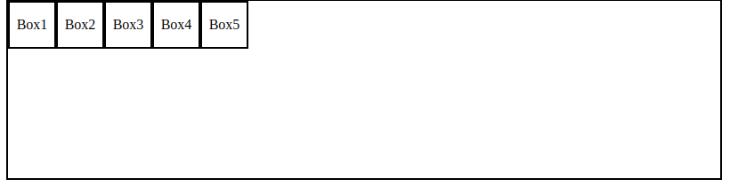
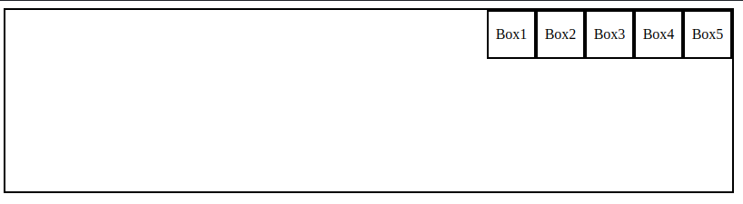
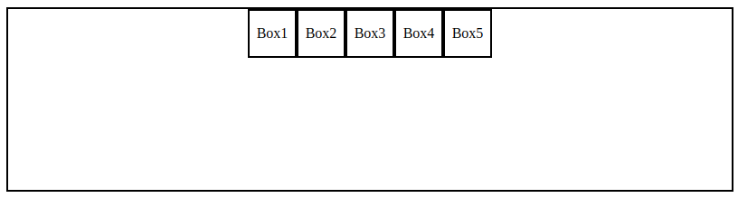
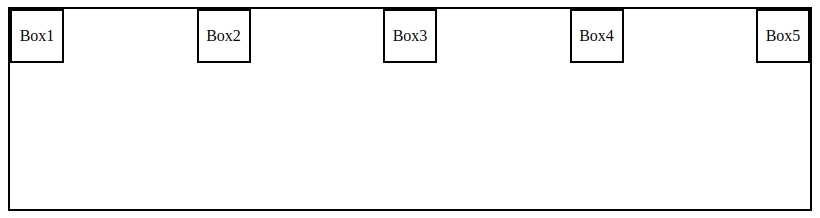
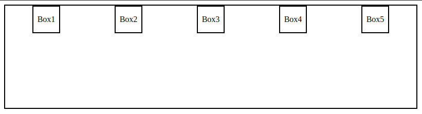
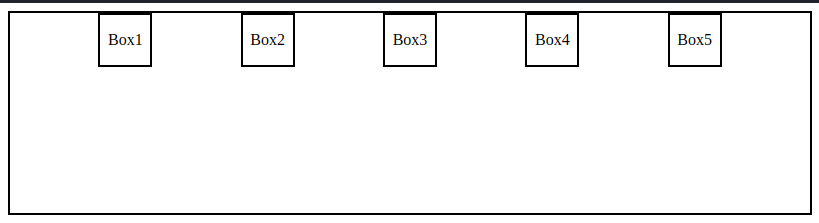

# FlexBox Properties

`justify-content: flex-start;` (default)

---

`justify-content: flex-end;` 

---

`justify-content: center;`

---

`justify-content: space-between;`

---

`justify-content: space-around;`

---

`justify-content: space-evenly;`

---