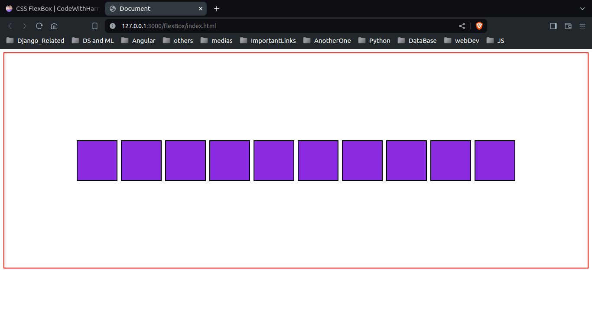
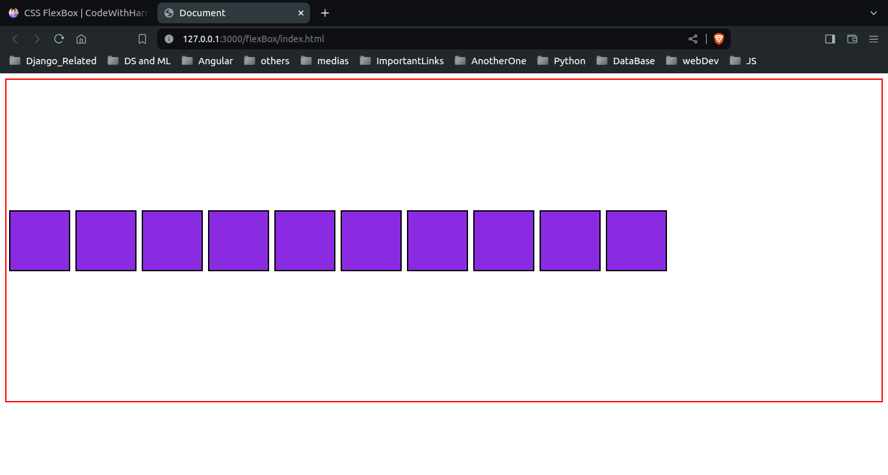
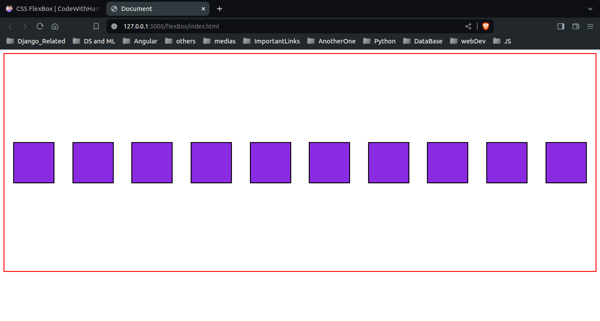
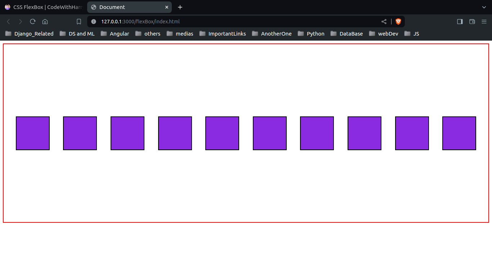
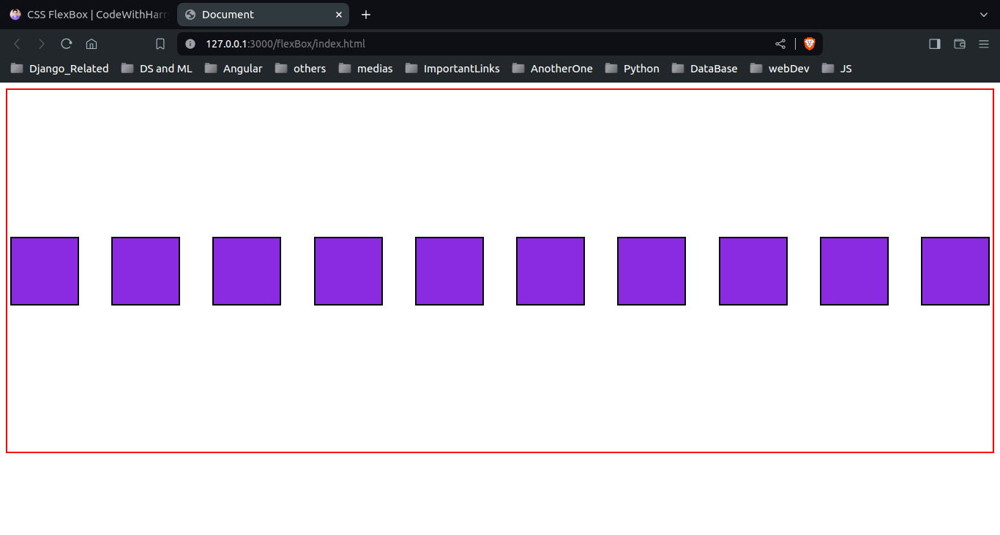

# flexBox

```
justify-content

center, 
baseline, 
flex-start, 
flex-end,  
end, 
left, 
right, 
space-around, 
space-between, 
space-evenly
```
```
display: flex;
justify-content: center; 
align-items: center; 
```



---

```
justify-content: start; 
```



---

```
justify-content: space-around; 
``` 



---

```
justify-content: space-evenly; 
``` 



---

```
justify-content: space-between; 
``` 



---
