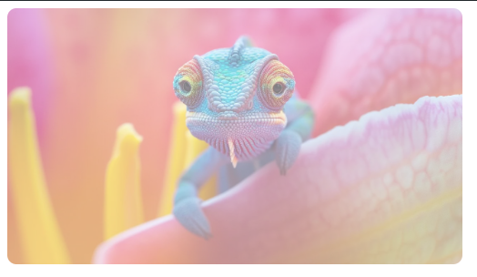
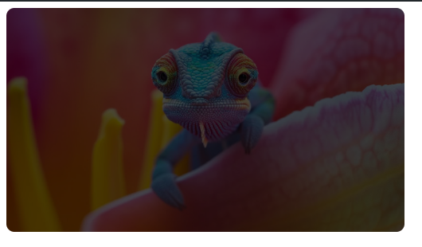
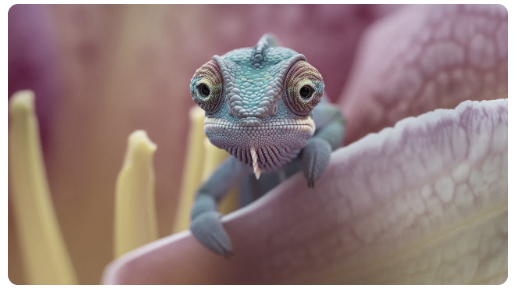
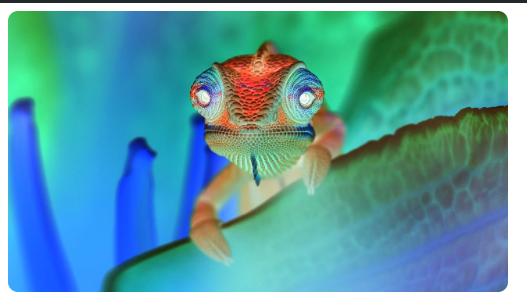
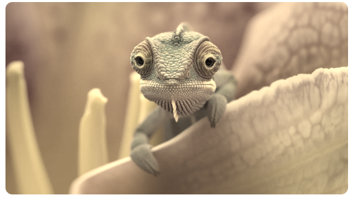

# Images

## Opacity

opacity: 0.5;

## Filter
---
filter: brightness(30%); 

---
filter: grayscale(70%); 

---

filter: invert(100%);

---

filter: sepia(90%); 

---

filter: blur(5px); 

---

